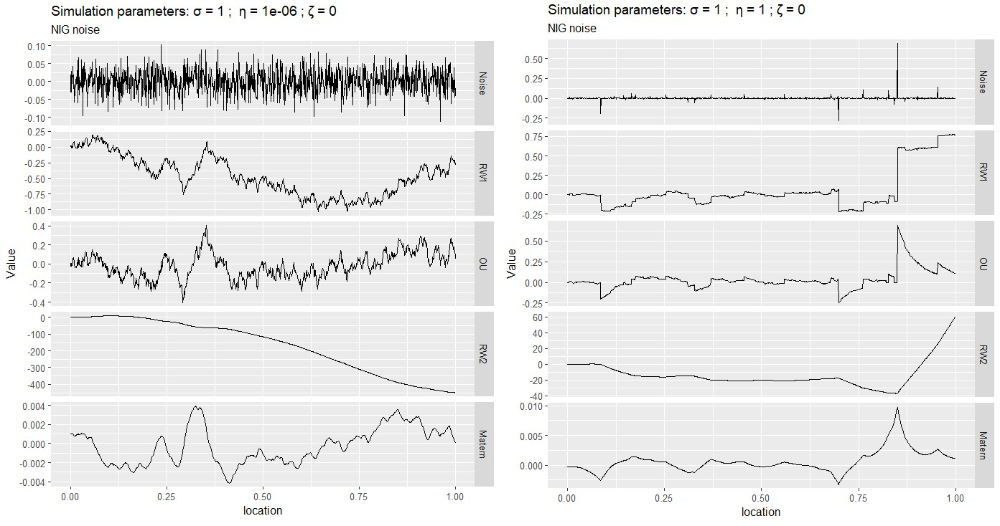
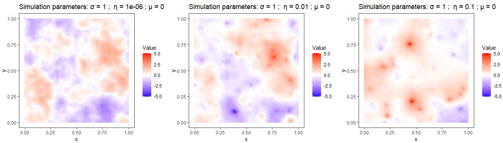

<!--
output: 
  html_vignette: 
    toc: yes

vignette: >
  %\VignetteEncoding{UTF-8}
  %\VignetteIndexEntry{bmstdr: Bayesian Modeling of Spatio-Temporal Data with R}
  %\VignetteEngine{knitr::rmarkdown}
-->

```{r setup, include=FALSE}
library(spdep)                # Columbus dataset
library(rgdal)                # Read polygon data
library(leaflet)              # Interactive widgets
library(leaflet.extras)       # Fullscreen control for Leaflet widget
library(cmdstanr)             # CmdStan R interface
library(posterior)            # Process the output of cmdstanr sampling
source("files/utils.R")       # Several utility functions
```


This vignette was written based on the following resources: 

 - Bookdown: [Fitting robust non-Gaussian models in Stan](rafaelcabral96.github.io/nigstan/)

 - Paper: [Controlling the flexibility of non-Gaussian processes through shrinkage priors](arxiv.org/abs/2203.05510)

The Bookdown offers a theoretical background, explicates the $Stan$ implementation, and contains several code examples for time series, geostatistical and areal data applications.


***

# What and Why


## 	Why go beyond Gaussian processes?

- Relax the assumption of Gaussianity: Gaussian processes can over-smooth in the presence of local spikes (@walder2020bayesian) and sudden jumps in the data (@NIGAR)
- Predictions: One can obtain more accurate predictions with smaller standard deviations if non-Gaussian features are present in the data,
- Robustness: Accommodate possible outliers in the data, and reduce their impact on the inferences (@west1984outlier)
 
## 	What type of non-Gaussian models are you considering? 

If $\mathbf{x}^G$ follows a multivariate Gaussian with mean $\mathbf{0}$  and precision matrix $\mathbf{Q}=  \mathbf{\mathbf{D}}^T\mathbf{D}$, it can be expressed through 

$$
\mathbf{D}\mathbf{x}^G\overset{d}{=} \mathbf{Z},
$$
where $\mathbf{Z}$ is a vector of i.i.d. standard Gaussian variables. The non-Gaussian extension for $\mathbf{x}^G$ consists in replacing the driving noise distribution:
$$
\mathbf{D}\mathbf{x}\overset{d}{=} \mathbf{\Lambda}(\eta^\star,\zeta^\star),
$$
where $\boldsymbol{\Lambda}$ is a vector of independent and standardized normal-inverse Gaussian (NIG) random variables that depend on the parameter $\eta^\star$ and $\zeta^\star$, which controls the leptokurtosis and skewness of the driving noise.

## 	Setup

The Gaussian model can be declared in Stan as: 

```
x ~ multi_normal_prec(rep_vector(0,N), D'*D)
```

The non-Gaussian model declaration is:
```
x ~ nig_model(D, etas, zetas, h, 1)
```

The argument `h` should be a vector of ones for discrete-space models. For models defined in continuous space, for instance, a continuous random walk of order 1, `h` contains the distance between locations. The last argument is an integer with value 1 if the log-determinant of $\mathbf{D}$ should be computed (if $\mathbf{D}$ depends on parameters), or 0 otherwise. 

The `nig_model` and other Stan functions can be found in `nigstan\files\functions.stan` on [github.com/rafaelcabral96/nigstan](github.com/rafaelcabral96/nigstan). The `nig_model` uses a collapsed representation of $\mathbf{x}$, and also has built-in within-chain parallelizations to improve speed. Other available functions are:

- `nig_model_2`: Similar to `nig_model` but leverages on the sparsity of $\mathbf{D}$ using Stan’s built-in functions for sparse matrix operations
- `nig_multi`: independent NIG model (useful for a non-centered parameterization)


## 	Why not just transform Gaussian processes?

For non-Gaussian datasets, a common approach is to start with a Gaussian process and then apply a non-linear transformation, such as the logarithm or the square root. However, @wallin2015geostatistical showed that the mean and covariance function of the transformed process could change in non-intuitive ways. For the square root transformation, if the mean of the Gaussian process contains covariates, this will induce a non-stationary covariance function for the data.

The non-Gaussian processes driven by NIG noise that we are considering allow modeling the 3 model components separately without confounding: the mean, the covariance structure, and the non-Gaussianity. Changing one component does not affect the others.
 
 
## 	What models fit into this framework?

We list some models that can be extended to non-Gaussianity in this way:

 - i.i.d. random effects;
 - Random walk (RW) and autoregressive processes (@ghasami2020autoregressive) for time series
 - Simultaneous autoregressive (@walder2020bayesian) and conditional autoregressive processes for graphical models and areal data
 - Matérn processes (@wallin2015geostatistical), which can be used in a variety of applications, such as in geostatistics and spatial point processes
 - More generally, several stochastic processes driven by Gaussian white noise defined via stochastic partial differential equations (SPDEs) $\mathcal{D}X(t) = \mathcal{W}(t)$ can be extended to non-Gaussianity by replacing $\mathcal{W}(t)$ by a NIG white noise distribution. The finite element method can be used to approximate $X(t)$ to discrete space, leading to the system $\mathbf{D}\mathbf{x} = \mathbf{\Lambda}$.

## 	What sample paths do these models produce?

The first row of the following figure shows Gaussian (left) and NIG (right) white noise processes. The rows below show several processes built from these driving noises, including RW1, RW2, Ornstein–Uhlenbeck (OU), and Matérn ($\alpha=2$) processes. Whenever the NIG noise takes an extreme value (for instance, near location 0.8), the CRW1 and OU processes will exhibit a distinct jump, and the RW2 and Matérn processes will exhibit a kink (discontinuity in the first derivative).





***

# Example (Columbus dataset)

The dataset consists of crime rates in thousands ($y_i$) in 49 counties of Columbus, Ohio, and can be found in the `spdep` R package. We will fit the following model:
$$
\mathbf{y}_{i}= \beta_0 + \beta_1 \text{HV}_i + \beta_2 \text{HI}_i +  \sigma\mathbf{x}_i,
$$
where $\text{HV}_i$ and $\text{HI}_i$ are the average household value and household income for county $i$, $\mathbf{x}$ is a spatial effects SAR model.  

```{r message=FALSE, warning=FALSE}
data(columbus)
data <- columbus[,c("CRIME","HOVAL","INC")]                              # data
N    <- nrow(data)                                                       # number of counties
map  <- readOGR(system.file("shapes/columbus.shp", package="spData")[1]) # shape file containing the polygons
```
In the next Leaflet widget, we show the crime rates and the two covariates.

```{r echo=FALSE}
rownames(data) <- 1:N-1

#Leaflet expects data to be specified in latitude and longitude using the WGS84 coordinate projection, so we transform mesh_map to this projection as follows
proj4string(map) <- CRS("+proj=longlat +datum=WGS84")
map  <- spTransform(map,CRS("+proj=longlat +datum=WGS84 +no_defs"))
map <- SpatialPolygonsDataFrame(map, data)

pal_crime <- colorNumeric(palette = "YlOrRd", domain = map$CRIME)
pal_hoval <- colorNumeric(palette = "YlOrRd", domain = map$HOVAL)
pal_inc   <- colorNumeric(palette = "YlOrRd", domain = map$INC)
leaflet(map) %>%
  addPolygons( color = "grey", weight = 1, fillColor = ~ pal_crime(CRIME), fillOpacity = 0.6, group = "Crime")   %>%
  addPolygons( color = "grey", weight = 1, fillColor = ~ pal_hoval(HOVAL), fillOpacity = 0.6, group = "House Value")   %>%
  addPolygons( color = "grey", weight = 1, fillColor = ~ pal_inc(INC),     fillOpacity = 0.6, group = "Income")  %>%
  addLegend_decreasing(pal = pal_crime, values = ~CRIME,title = "Crime (in thousands)",
                       position = "bottomright", decreasing = TRUE, group = "Crime")  %>%
  addLegend_decreasing(pal = pal_hoval, values = ~HOVAL,title = "Average Household Value",
                       position = "bottomright", decreasing = TRUE, group = "House Value")  %>%
  addLegend_decreasing(pal = pal_inc, values = ~INC,  title = "Average Household Income",
                       position = "bottomright", decreasing = TRUE, group = "Income") %>%
  addLayersControl(overlayGroups = c("Crime", "House Value","Income"),
                   options = layersControlOptions(collapsed = FALSE))  %>%
  hideGroup("House Value")  %>%
  hideGroup("Income") %>%
  addFullscreenControl()
```


We consider a simultaneous autoregressive (SAR) model for the spatially structured effects $\mathbf{x}$. The Gaussian version of this model can be built from the following system $\mathbf{D}_{SAR}\mathbf{x} = \sigma\mathbf{Z}$, where $\mathbf{D}_{SAR}=\mathbf{I}-\rho\mathbf{W}$. The matrix $\mathbf{W}$ is the row standardized adjacency matrix and $-1<\rho<1$. The equivalent model driven by NIG noise is then $\mathbf{D}_{SAR}\mathbf{x} = \sigma\mathbf{\Lambda}$, where $\mathbf{\Lambda}$ is i.i.d. standardized NIG noise. 

We obtain next the adjacency matrix $\mathbf{W}$.

```{r}
nb_q <- poly2nb(map)                                   # Construct neighbours list from polygon list
nb_W <- nb2listw(nb_q, style="B", zero.policy=TRUE)    # Spatial weights for neighbours lists
W    <- as.matrix(as(nb_W, "sparseMatrix"))            # Adjacency matrix W
W    <- diag(1/rowSums(W))%*%W                         # Row standardize adjacency matrix  
```

We build the design matrix $\mathbf{B}$ and the list to be passed to Stan next:

```{r}
B <- cbind(rep(1,N),data[,c(2,3)])                      #Design matrix

dat1 <- list(N              = N,                        #Number of observations
             N_covariates   = 3,                        #Number of covariates
             y              = data$CRIME,               #Observations
             B              = B,                        #Design matrix
             W              = W,                        #Row standardized adjacency matrix
             thetaetas      = 1,                        #Rate parameter of the exponential prior for etas
             thetazetas     = 2)                        #Rate parameter of the exponential prior for zetas
```

## Gaussian fit

An (inefficient) implementation of the Gaussian SAR model is:

```{}
transformed parameters{
  vector[N] x = (y - B*beta)/sigma;                   // Spatial effects
}

model{
  matrix[N,N] D = add_diag(-rho*W, 1);                // D = I - rho W;
  x ~ multi_normal_prec(rep_vector(0,N), D'*D);       
  ...
}
```


```{r, eval = FALSE}
model_stan_Gauss <- cmdstan_model('files/GaussSAR.stan')
fit_Gauss <- model_stan_Gauss$sample(data = dat1, 
                                     chains = 4, 
                                     iter_warmup   = 2000, 
                                     iter_sampling = 3000)

fit_Gauss$save_object("files/Gauss_fit.rds")
fit_Gauss$cmdstan_diagnose() #No warnings
``` 

Let us look at the summary:

```{r}
fit_Gauss <- readRDS("files/Gauss_fit.rds")
knitr::kable(head(fit_Gauss$summary(),6), "simple", row.names = NA, digits=2)
``` 


## NIG fit

The SAR model driven with NIG noise can be declared in Stan by just changing one line of code of the Gaussian Stan model. 

```{}
transformed parameters{
  vector[N] X = (y - B*beta)/sigma;                       // Spatial effects
}

model{

  matrix[N,N] D = add_diag(-rho*W, 1);                    // D = I - rho W;
  X ~ nig_model(D, etas, zetas, h, 1);
.,.
```

```{r, eval = FALSE}
model_stan_NIG <- cmdstan_model('files/NIGSAR.stan')
fit_NIG <- model_stan_NIG$sample(data = dat1, 
                                 chains = 4, 
                                 iter_warmup = 2000, 
                                 iter_sampling = 3000)

fit_NIG$save_object("files/NIG_columbus.rds")
fit_NIG$cmdstan_diagnose() #No warnings
``` 

The posterior distributions for the regression coefficients were similar, and the posterior distributions of $\eta^\star$ and $\zeta^\star$ suggest heavy-tailedness although no asymmetry.

```{r}
fit_NIG <- readRDS("files/NIG_columbus.rds")
knitr::kable(head(fit_NIG$summary(),8), "simple", row.names = NA, digits=2)
``` 


The NIG noise $\Lambda_i$ can be seen as a normal variance mixture. In the symmetric case, $\Lambda_i|V_i \sim N(0,V_i)$, where $V_i$ are inverse-Gaussian mixing variables. The posterior draws for $\mathbf{V} = [V_1,\dotsc,V_N]^T$ can be generated from the posterior draws of $\mathbf{x}$, $\eta^\star$, $\zeta^\star$ and $\rho$ as done next. We utilized the function `VposteriorSAR` located at `files/utils.R`. High values for $V_i$ indicate that region $i$ had a spike in the spatial effects that was not captured by the covariates, which are too large to be modeled by a Gaussian model. 

```{r}
X     <- as.matrix(as_draws_df(fit_NIG$draws("x")))[,1:N]
etas  <- as.matrix(as_draws_df(fit_NIG$draws("etas")))[,1]
zetas <- as.matrix(as_draws_df(fit_NIG$draws("zetas")))[,1]
rho   <- as.matrix(as_draws_df(fit_NIG$draws("rho")))[,1]
h     <- rep(1,N)

V_post <- VposteriorSAR(X, rho, W, etas, zetas, h)
```

In the next leaflet widget, we show the posterior mean and standard deviation of the spatial effects as well as the posterior mean of $\mathbf{V}$.

```{r echo=FALSE}
sigma      <- as.matrix(as_draws_df(fit_NIG$draws("sigma")))[,1]
sigmaX     <- sigma*as.matrix(as_draws_df(fit_NIG$draws("x")))[,1:N]
V          <- colMeans(V_post)

data$xmean <- colMeans(sigmaX)
data$xsd   <- apply(sigmaX,2,sd)
data$V     <- V

rownames(data) <- 1:N-1
map <- SpatialPolygonsDataFrame(map, data)
pal_xmean <- colorNumeric(palette = c("blue","white","red"), domain = map$xmean)
pal_xsd   <- colorNumeric(palette = "YlOrRd", domain = map$xsd)
pal_V     <- colorNumeric(palette = "YlOrRd", domain = map$V)

leaflet(map) %>%
  addPolygons( color = "grey", weight = 1, fillColor = ~ pal_xmean(xmean), fillOpacity = 0.6, group = "X mean")   %>%
  addPolygons( color = "grey", weight = 1, fillColor = ~ pal_xsd(xsd)    , fillOpacity = 0.6, group = "X sd"  )   %>%
  addPolygons( color = "grey", weight = 1, fillColor = ~ pal_V(V)        , fillOpacity = 0.6, group = "V mean")   %>%
  addLegend_decreasing(pal = pal_xmean, values = ~xmean,title = "Mean of spatial effects",
                       position = "bottomright", decreasing = TRUE, group = "X mean")  %>%
  addLegend_decreasing(pal = pal_xsd, values = ~xsd, title = "SD of Spatial effects",
                       position = "bottomright", decreasing = TRUE, group = "X sd")  %>%
  addLegend_decreasing(pal = pal_V, values = ~V, title = "mean of V",
                       position = "bottomright", decreasing = TRUE, group = "V mean")  %>%
  addLayersControl(overlayGroups = c("X mean", "X sd","V mean"),
                   options = layersControlOptions(collapsed = FALSE))  %>%
  hideGroup(c("X sd","V mean"))  %>%
  addFullscreenControl()
```

***

# References
